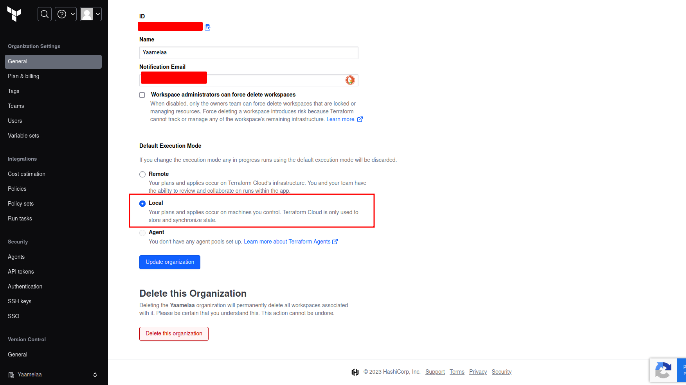

# Terraform Beginner Bootcamp 2023

- [Terraform Beginner Bootcamp 2023](#terraform-beginner-bootcamp-2023)
  * [Semantic Versioning :mage:](#semantic-versioning--mage-)
  * [Terraform CLI Refactoring](#terraform-cli-refactoring)
    + [GPG Command](#gpg-command)
  * [Working with Environment variables](#working-with-environment-variables)
    + [Set Env vars globally](#set-env-vars-globally)
  * [AWS CLI installation](#aws-cli-installation)
  * [Terraform Basics](#terraform-basics)
    + [Terraform Registry](#terraform-registry)
    + [Terraform Cloud](#terraform-cloud)
    + [Automate Terraform login](#automate-terraform-login)
    + [Terraform cloud organization](#terraform-cloud-organization)
  * [Root Module Structure](#root-module-structure)
  * [Terraform import and configuration drift](#terraform-import-and-configuration-drift)
  * [What happens if we lose our state file?](#what-happens-if-we-lose-our-state-file-)
    + [Fix Missing Resources with Terraform Import](#fix-missing-resources-with-terraform-import)
    + [Fix Manual Configuration](#fix-manual-configuration)
  * [Terraform Modules](#terraform-modules)
    + [Terraform Module Structure](#terraform-module-structure)
    + [Passing Input Variables](#passing-input-variables)
    + [Modules Sources](#modules-sources)

<small><i><a href='http://ecotrust-canada.github.io/markdown-toc/'>Table of contents generated with markdown-toc</a></i></small>

## Semantic Versioning :mage:

Given a version number MAJOR.MINOR.PATCH, increment the:

1. MAJOR version when you make incompatible API changes
2. MINOR version when you add functionality in a backward compatible manner
3. PATCH version when you make backward compatible bug fixes

Additional labels for pre-release and build metadata are available as extensions to the MAJOR.MINOR.PATCH format.
Source: [Semantic Versioning](https://semver.org).

## Terraform CLI Refactoring

**Terraform CLI installation** [documentation](https://developer.hashicorp.com/terraform/downloads) for **Linux > Ubuntu/Debian**.

### GPG Command
* Was getting the following when running 
```
wget -O- https://apt.releases.hashicorp.com/gpg | sudo gpg --dearmor -o /usr/share/keyrings/hashicorp-archive-keyring.gpg -y
```
>  File '/usr/share/keyrings/hashicorp-archive-keyring.gpg' exists. Overwrite? (y/N)
* This message shows up at second run if the gpg key already exists
* Use `-y` parameter with gpg to force command execution even if the key already exists.

## Working with Environment variables

* List all environment variables (env vars) using `env` command.
* Set env vars using `export VARIABLE_NAME=VALUE`
* Unset env vars using `unset VARIABLE_NAME`
* Print env vars using `echo $VARIABLE_NAME`

### Set Env vars globally

* Make env vars persistent across terminals by using bash profile
* Make env vars persistent in **Gitpod secrets** by using `gp`. An example is:
    ```bash
    gp env VARIABLE_NAME=VALUE`
    ```

## AWS CLI installation

* Installation Reference [documentation](https://docs.aws.amazon.com/cli/latest/userguide/getting-started-install.html).
* Setup env vars for AWS configuration. ***Don't*** use `aws configure` for production environment.
* Check if AWS credentials are set up correctly by running the following:
    ```sh
    aws sts get-caller-identity
    ```
    * For this command to be successful you need to generate AWS credentials and add to env vars as shown in [.env.example](./.env.example).

    * If it is succesful you should see a json payload like this:
        > ```json
        > {
        > "UserId": "ABCDEFGHEJKLMNOPR",
        > "Account": "123456789012",
        > "Arn": "arn:aws:iam::123456789012:user/terraform-beginner-bootcamp"
        > }
        > ```
* [Environment variables to configure the AWS CLI](https://docs.aws.amazon.com/cli/latest/userguide/cli-configure-envvars.html).

## Terraform Basics

### Terraform Registry

* [Registry.terraform.io](https://registry.terraform.io)
* [Providers](https://registry.terraform.io/browse/providers)
* [Modules](https://registry.terraform.io/browse/modules)

* `terraform init`
* `terraform plan`
* `terraform apply` → Without prompting for 'yes' run `terraform apply --auto-approve`
* *terraform.tfstate* → State file, current state of the infrastructure. This file should not never be commit to version control system (vcs) because 
    it contains very sensitive information. This file should never be lost for an exisitng infrastructure. 
* *.terraform.lock.hcl* → Lock file
* `terraform destroy`


### Terraform Cloud

* To use Terraform cloud add the following in the terraform block:
    ```
    cloud {
        organization = "NameOfOrganization"
        
        workspaces {
        name = "NameOfWorkspace"
        }
    }
    ```
* Goto this [page](https://app.terraform.io/app/settings/tokens?source=terraform-login) to generate a Terraform cloud token. 
* Gitpod stores the token in `/home/gitpod/.terraform.d/credentials.tfrc.json`
* To manually create `credentials.tfrc.json`:
    ```bash
    touch /home/gitpod/.terraform.d/credentials.tfrc.json
    open /home/gitpod/.terraform.d/credentials.tfrc.json
    ```
* Content of `/home/gitpod/.terraform.d/credentials.tfrc.json`:
    ```
    {
        "credentials": {
            "app.terraform.io": {
                "token": "YOUR-TERRAFORM-CLOUD-TOKEN"
            }
        }
    }
    ```

### Automate Terraform login

* Script to generate credentials [bin/generate_tfrc_creds](./bin/generate_tfrc_creds)
* For the script to generate the json file, setup the env var `TERRAFORM_CLOUD_TOKEN`


### Terraform cloud organization

* The Default Execution Mode should be set up as **Local** not ~~Remote~~.



* Setting Remote execution mode will cause a credentials error when executing `Terraform plan`
```
Error: No valid credential sources found
│ 
│   with provider["registry.terraform.io/hashicorp/aws"],
│   on main.tf line 22, in provider "aws":
│   22: provider "aws" {
│ 
│ Please see https://registry.terraform.io/providers/hashicorp/aws
│ for more information about providing credentials.
│ 
│ Error: failed to refresh cached credentials, no EC2 IMDS role found,
│ operation error ec2imds: GetMetadata, request canceled, context deadline
│ exceeded
│ 
```

## Root Module Structure

Our root module structure is as follows:

PROJECT_ROOT
│
├── main.tf                 # everything else.
├── variables.tf            # stores the structure of input variables
├── terraform.tfvars        # the data of variables we want to load into our terraform project
├── providers.tf            # defined required providers and their configuration
├── outputs.tf              # stores our outputs
└── README.md               # required for root modules


## Terraform import and configuration drift

* Removed `random` resource (Use this [site](https://www.gigacalculator.com/randomizers/random-string-generator.php) to generate random strings)
* Add terraform veriable `bucket.name`

## What happens if we lose our state file?

* If you lose your statefile, you most likley have to tear down all your cloud infrastructure manually.
* You can use terraform import but it won't work for all cloud resources. You need check the terraform providers documentation for which resources support import.

### Fix Missing Resources with Terraform Import

`terraform import aws_s3_bucket.bucket <bucket-name>`

[Terraform Import](https://developer.hashicorp.com/terraform/cli/import)
[AWS S3 Bucket Import](https://registry.terraform.io/providers/hashicorp/aws/latest/docs/resources/s3_bucket#import)

### Fix Manual Configuration

* If someone goes and deletes or modifies your cloud resource manually through ClickOps. 
* If we run Terraform plan it will attempt to put our infrastructure back into the expected state fixing the *Configuration Drift*.

## Terraform Modules

### Terraform Module Structure

It is recommended to place modules in a `modules` directory when locally developing modules but you can name it whatever you like.

### Passing Input Variables

We can pass input variables to our module.
The module has to declare the terraform variables in its own variables.tf

```tf
module "terrahouse_aws" {
  source = "./modules/terrahouse_aws"
  user_uuid = var.user_uuid
  bucket_name = var.bucket_name
}
```

### Modules Sources

Using the source we can import the module from various places, eg:
- locally
- Github
- Terraform Registry

```tf
module "terrahouse_aws" {
  source = "./modules/terrahouse_aws"
}
```

## Working with Files in Terraform


### Fileexists function

This is a built-in terraform function to check the existence of a file.

```tf
condition = fileexists(var.error_html_filepath)
```

https://developer.hashicorp.com/terraform/language/functions/fileexists

### Filemd5

https://developer.hashicorp.com/terraform/language/functions/filemd5

### Path Variable

In terraform there is a special variable called `path` that allows us to reference local paths:
- path.module = get the path for the current module
- path.root = get the path for the root module
[Special Path Variable](https://developer.hashicorp.com/terraform/language/expressions/references#filesystem-and-workspace-info)

```
resource "aws_s3_object" "index_html" {
  bucket = aws_s3_bucket.project_bucket.bucket
  key    = "index.html"
  source = var.index_html_filepath
}
```

The value of the path variable should be relative to the workspace. That is:
```
index_html_filepath="public/index.html"
error_html_filepath="public/error.html"
```

And not:
```
index_html_filepath="/workspace/terraform-beginner-bootcamp-2023/public/index.html"
error_html_filepath="/workspace/terraform-beginner-bootcamp-2023/public/error.html"
```

## Terraform Locals

Locals allows us to define local variables.
It can be very useful when we need to transform data into another format and have to reference a variable.

```tf
locals {
  s3_origin_id = "MyS3Origin"
}
```
[Local Values](https://developer.hashicorp.com/terraform/language/values/locals)

## Terraform Data Sources

This allows to use data source from cloud resources.

This is useful when we want to reference cloud resources without importing them.

```tf
data "aws_caller_identity" "current" {}

output "account_id" {
  value = data.aws_caller_identity.current.account_id
}
```
[Data Sources](https://developer.hashicorp.com/terraform/language/data-sources)

## Working with JSON

We use the jsonencode to create the json policy inline in the hcl.

```tf
> jsonencode({"hello"="world"})
{"hello":"world"}
```

[jsonencode](https://developer.hashicorp.com/terraform/language/functions/jsonencode)


### Changing the Lifecycle of Resources

[The lifecycle Meta-Argument](https://developer.hashicorp.com/terraform/language/meta-arguments/lifecycle)

## Terraform Data

Plain data values such as Local Values and Input Variables don't have any side-effects to plan against and so they aren't valid in replace_triggered_by. You can use terraform_data's behavior of planning an action each time input changes to indirectly use a plain value to trigger replacement.


```
variable "revision" {
  default = 1
}

resource "terraform_data" "replacement" {
  input = var.revision
}

# This resource has no convenient attribute which forces replacement,
# but can now be replaced by any change to the revision variable value.
resource "example_database" "test" {
  lifecycle {
    replace_triggered_by = [terraform_data.replacement]
  }
}

```
https://developer.hashicorp.com/terraform/language/resources/terraform-data


## Provisioners

Provisioners allow you to execute commands on compute instances eg. an AWS CLI command.

They are not recommended for use by Hashicorp because Configuration Management tools such as Ansible are a better fit, but the functionality exists.

[Provisioners](https://developer.hashicorp.com/terraform/language/resources/provisioners/syntax)

### Local-exec

This will execute command on the machine running the terraform commands eg. plan apply

```tf
resource "aws_instance" "web" {
  # ...

  provisioner "local-exec" {
    command = "echo The server's IP address is ${self.private_ip}"
  }
}
```

https://developer.hashicorp.com/terraform/language/resources/provisioners/local-exec

### Remote-exec

This will execute commands on a machine which you target. You will need to provide credentials such as ssh to get into the machine.

```tf
resource "aws_instance" "web" {
  # ...

  # Establishes connection to be used by all
  # generic remote provisioners (i.e. file/remote-exec)
  connection {
    type     = "ssh"
    user     = "root"
    password = var.root_password
    host     = self.public_ip
  }

  provisioner "remote-exec" {
    inline = [
      "puppet apply",
      "consul join ${aws_instance.web.private_ip}",
    ]
  }
}
```
https://developer.hashicorp.com/terraform/language/resources/provisioners/remote-exec

## Fileset function

This function expects 2 arguments/ the *path* and the *pattern*.

Use `terraform console` to test this function.
```
> fileset("${path.root}/public", "*")
toset([
  "error.html",
  "index.html",
  "supermario.jpg",
])
> fileset("${path.root}/public", "*.{jpg,png,gif}")
toset([
  "supermario.jpg",
])
>  
```

## For Each Expressions

For each allows us to enumerate over complex data types

```sh
[for s in var.list : upper(s)]
```

This is mostly useful when you are creating multiples of a cloud resource and you want to reduce the amount of repetitive terraform code.

[For Each Expressions](https://developer.hashicorp.com/terraform/language/expressions/for)

## Week1 Project Validation

### Content type

The validation tool throws a fail when checking the object type of index.html.
Changing the html code by explicitly setting the content type in the headers `meta` tag did not solve the issue.
Need to add `content_type = "text/html"` in the `aws_s3_object` resource definition.


## Working with Ruby

### Bundler

Bundler is a package manager for ruby.
It is the primary way to install ruby packages (known as gems).

#### Install Gems

You need to create a **Gemfile** and define your gems in that file.

```rb
source "https://rubygems.org"

gem 'sinatra'
gem 'rake'
gem 'pry'
gem 'puma'
gem 'activerecord'
```

Then you need to run the `bundle install` command
This will install the gems on the system globally (unlike nodejs which installs packages in place in a folder called node_modules)
A Gemfile.lock will be created to lock down the gem versions used in this project.

#### Executing ruby scripts in the context of bundler

We have to use `bundle exec` to tell future ruby scripts to use the gems we installed. This is the way we set context.

### Sinatra

Sinatra is a micro web-framework for ruby to build web-apps.
Its great for mock or development servers or for very simple projects.
You can create a web-server in a single file.
https://sinatrarb.com/


## Terratowns Mock Server

### Running the web server

We can run the web server by executing the following commands:

```rb
bundle install
bundle exec ruby server.rb
```

All of the code for our server is stored in the `server.rb` file.